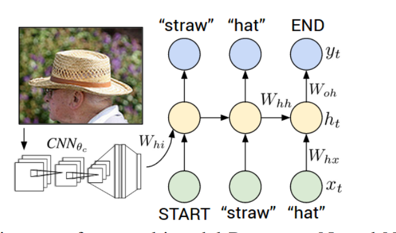

# 深度神经网络模型(Deep Neural Networks, DNN)

 

使用 Numpy 实现了 3 种经典的深度神经网络模型, 包括 RNN, LSTM, CNN

## 项目结构
    .
    ├── dataset                 # 数据集
    ├── docs                    # 参考文献
    ├── lib                     # 模块库
    ├── logs                    # 记录不同模型在不同数据集下的实验结果 
    ├── models                  # 模型的检查点
    ├── ref                     # 参考项目
    ├── src_bak                 # 项目的历史版本的源码
    ├── image_caption_solver_xrh.py # 图片描述生成主程序
    └── image_classify_solver_xrh.py # 图片分类主程序

## 1.基于 RNN/LSTM 的图片描述生成 (Image Caption)

主程序位置: [image_caption_solver_xrh.py](image_caption_solver_xrh.py)

### 1.1 模型设计

 

1. 使用 numpy 实现了整个神经网络的所有层(包括正向传播算法和反向传播算法), 
从下往上依次为 : 词嵌入层, 图片嵌入层, 中间层(RNN/LSTM), 时序仿射输出层

2. 原始图片经过预训练的 CNN 的特征抽取后的图片向量再输入图片嵌入层, 图片嵌入层作为 RNN/LSTM 的初始隐藏层状态(h0) 

3. 实现了优化算法: MinBatch, Momentum, Adam

### 1.2 实验结果

1.Microsoft COCO 数据集

> 对 Microsoft COCO 数据集中的所有图片用 CNN(VGG-16) 进行特征提取, 并使用 PCA 降维, 我们采用降维后的图片特征(n_p=512)
作为 RNN/LSTM 的隐藏层的输入

> 在数据集的子集上的实验结果: [logs/image_caption/microsoft_coco_lstm_512_512.log](logs/image_caption/microsoft_coco_lstm_512_512.log)

> 整个数据集训练花费时间太长, 待补充

验证集/测试集  | Bleu1 | Bleu2 | 
--------------| ------|-------|
dev |  |   | 
test |  |   | 

### 1.3 Ref

1. Deep Visual-Semantic Alignments for Generating Image Descriptions

2. Show and Tell: A Neural Image Caption Generator

3. http://cs231n.stanford.edu/schedule.html

4. https://github.com/jariasf/CS231n

## 2. 基于 CNN 的图片分类器

主程序位置: [image_classify_solver_xrh.py](image_classify_solver_xrh.py)

### 2.1 模型设计

参考 LeNet-5 网络, 使用 numpy 实现了整个神经网络的各个层(包括正向传播算法和反向传播算法), 详见下表

    0. 图片输入层 'input'
        output: shape (N,1,28,28), 28*28=784

    1. 卷积层 'conv1'

        config_conv1 = { 'f':3, 's':1, 'p':1, 'n_c':6 }
        'f' - 卷积核大小, 's' -窗口滑动步长, 'p' - padding填充的个数

                         N  C   H   W
        input :  shape ( N, 1, 28, 28)
        output : shape ( N, 6, 28, 28)

        N - 样本个数, C - 通道个数, H - 特征图的高度, W - 特征图的宽度

    2. relu 激活层 'relu1'

    3. 最大池化层 'max_pool1'

        config_pool1 = {'f':2, 's':2}
        'f' - 池化核大小, 's' -窗口滑动步长

        input :  shape (N,6,28,28)
        output : shape (N,6,14,14)

    4. 卷积层 'conv2'

        config_conv1 = { 'f':5, 's':1, 'p':0, 'n_c':16 }
        'f' - 卷积核大小, 's' -窗口滑动步长, 'p' - padding填充的个数
    
                         N  C   H   W
        input :  shape ( N, 6, 14, 14)
        output : shape ( N, 16, 10, 10)
    
        N - 样本个数, C - 通道个数, H - 特征图的高度, W - 特征图的宽度

    5. relu 激活层 'relu2'

    6. 最大池化层 'max_pool2'

        config_pool1 = {'f':2, 's':2}
        'f' - 池化核大小, 's' -窗口滑动步长

        input :  shape (N,16,10,10)
        output : shape (N,16,5,5)

    7. 全连接层 'affine1'

        input :  shape (N,16,5,5) , 15*5*5 = 400
        output : shape (N,10)

### 2.2 实验结果

    1.Mnist 数据集(多分类)
    
        n_train = 60000
        n_test = 10000
    
        使用 relu 激活函数
        使用 Adam 梯度下降, beta1 = 0.9, beta2 = 0.999
        mini_batch_size = 512
        num_epochs=5
        learning_rate= 5e-3
    
        test accuracy：0.9823
        train accuracy : 0.9865
        训练时长： 514s

### 2.3 Ref

1. Gradient-based learning applied to document recognition

2. http://cs231n.stanford.edu/schedule.html

3. https://github.com/jariasf/CS231n

## Note

1. 相关数据集下载详见: [dataset/readme.txt](dataset/readme.txt)

2. 软件环境 [Requirements](requirements.txt)

3. 梯度检验很重要: 因为在某些情况, 反向传播算法推错了模型训练时还能顺利收敛, 就是训练到后期出现收敛缓慢, 这导致排错困难

4. 先用小数据集验证模型的准确性, 最后推理时效果不好有可能是模型推理部分的 bug, 通过分析不好的结果可以反推出问题

