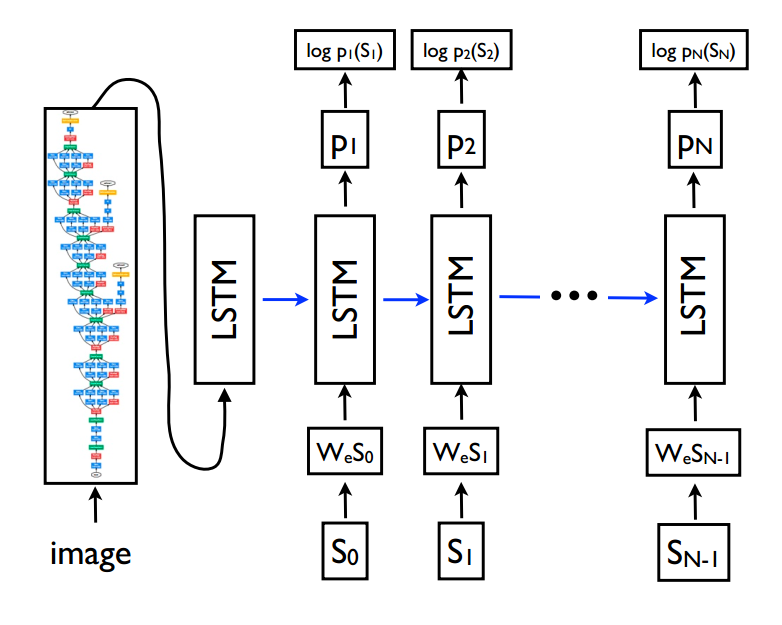

# 深度神经网络(DNN)模型

## 1.基于 RNN 的图片注释 (image caption)

### 1.1 模型设计

使用 numpy 实现了整个神经网络的各个层(包括正向传播算法, 反向传播算法和优化算法), 
从下往上依次为 : 词嵌入层, 图片嵌入层, RNN中间层, 时序仿射输出层
    
 
    
原始图片经过预训练的 CNN 的特征抽取后的图片向量再输入图片嵌入层, 图片嵌入层作为 RNN 的初始隐藏层状态(h0) 

模型结构详见 http://cs231n.stanford.edu/slides/2021/lecture_10.pdf (第74页 - 第87页)
    

### 1.2 实验结果

1.Microsoft COCO 数据集

对 Microsoft COCO 数据集中的所有图片用 CNN(VGG-16) 进行特征提取, 并使用 PCA 降维, 我们采用降维后的图片特征(n_p=512)
作为 模型 LSTM 的隐藏层的输入

## 2.基于 LSTM 的图片注释 (image caption)

### 2.1 模型设计

使用 numpy 实现了整个神经网络的各个层(包括正向传播算法, 反向传播算法和优化算法), 
从下往上依次为 : 词嵌入层, 图片嵌入层, LSTM中间层, 时序仿射输出层

 

原始图片经过预训练的 CNN 的特征抽取后的图片向量再输入图片嵌入层, 图片嵌入层作为 LSTM 的初始隐藏层状态(h0)

### 2.2 实验结果

1.Microsoft COCO 数据集

对 Microsoft COCO 数据集中的所有图片用 CNN(VGG-16) 进行特征提取, 并使用 PCA 降维, 我们采用降维后的图片特征(n_p=512)
作为 模型 LSTM 的隐藏层的输入

2.Flicker8k 数据集

训练数据集大小: 32360

超参数
hidden_dim=512,
wordvec_dim=512,
'learning_rate': 5e-3
num_epochs=5,
batch_size=256,

测试集上的评价

## 3. 基于 CNN 的图片分类器

### 3.1 模型设计

参考 LeNet-5 网络, 使用 numpy 实现了整个神经网络的各个层(包括正向传播算法, 反向传播算法和优化算法)

    0. 图片输入层 'input'
        output: shape (N,1,28,28), 28*28=784

    1. 卷积层 'conv1'

        config_conv1 = { 'f':3, 's':1, 'p':1, 'n_c':6 }
        'f' - 卷积核大小, 's' -窗口滑动步长, 'p' - padding填充的个数

                         N  C   H   W
        input :  shape ( N, 1, 28, 28)
        output : shape ( N, 6, 28, 28)

        N - 样本个数, C - 通道个数, H - 特征图的高度, W - 特征图的宽度

    2. relu 激活层 'relu1'

    3. 最大池化层 'max_pool1'

        config_pool1 = {'f':2, 's':2}
        'f' - 池化核大小, 's' -窗口滑动步长

        input :  shape (N,6,28,28)
        output : shape (N,6,14,14)

    4. 卷积层 'conv2'

    config_conv1 = { 'f':5, 's':1, 'p':0, 'n_c':16 }
    'f' - 卷积核大小, 's' -窗口滑动步长, 'p' - padding填充的个数

                     N  C   H   W
    input :  shape ( N, 6, 14, 14)
    output : shape ( N, 16, 10, 10)

    N - 样本个数, C - 通道个数, H - 特征图的高度, W - 特征图的宽度

    5. relu 激活层 'relu2'

    6. 最大池化层 'max_pool2'

        config_pool1 = {'f':2, 's':2}
        'f' - 池化核大小, 's' -窗口滑动步长

        input :  shape (N,16,10,10)
        output : shape (N,16,5,5)

    7. 全连接层 'affine1'

        input :  shape (N,16,5,5) , 15*5*5 = 400
        output : shape (N,10)

### 3.2 实验结果

    1.Mnist 数据集(多分类)
        n_train = 60000
        n_test = 10000
    
        使用 relu 激活函数
        使用 Adam 梯度下降, beta1 = 0.9, beta2 = 0.999
        mini_batch_size = 512
        num_epochs=5
        learning_rate= 5e-3
    
        test accuracy：0.9823
        train accuracy : 0.9865
        训练时长： 514s

## Ref

1.https://github.com/jariasf/CS231n

2.http://cs231n.stanford.edu/schedule.html

3.Deep Visual-Semantic Alignments for Generating Image Descriptions

4.Show and Tell: A Neural Image Caption Generator

## Note

1.梯度检验太重要了, 因为在某些情况, 反向传播算法推错了模型训练时还能顺利收敛, 
就是训练到后期出现收敛缓慢, 并且很难排错

2.先用小数据集验证模型的准确性, 最后推理时效果不好有可能是模型推理部分的 bug, 通过分析不好的结果可以反推出问题

3.Microsoft COCO 数据集

stanford cs231n 预处理过的数据集下载 http://cs231n.stanford.edu/coco_captioning.zip

原始数据集下载 https://cocodataset.org/#download

4.Flicker8k 数据集

数据集下载: 
https://github.com/jbrownlee/Datasets/releases/download/Flickr8k/Flickr8k_Dataset.zip
https://github.com/jbrownlee/Datasets/releases/download/Flickr8k/Flickr8k_text.zip

